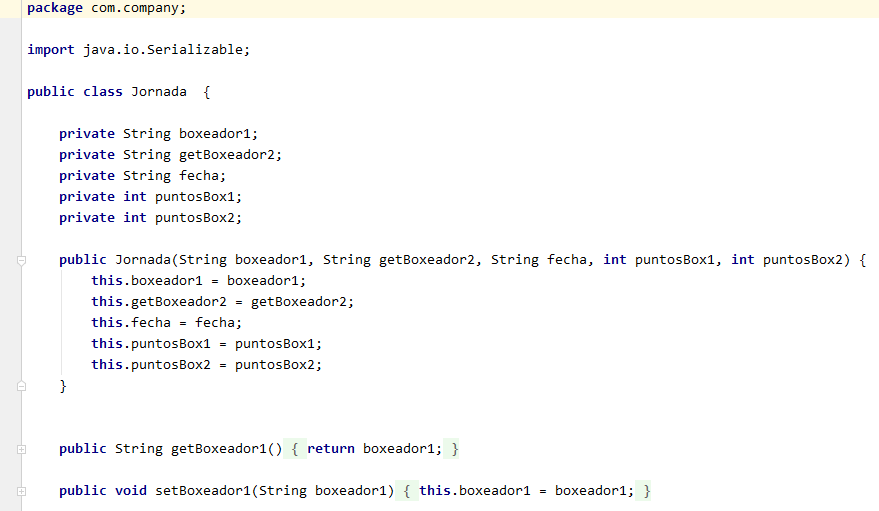
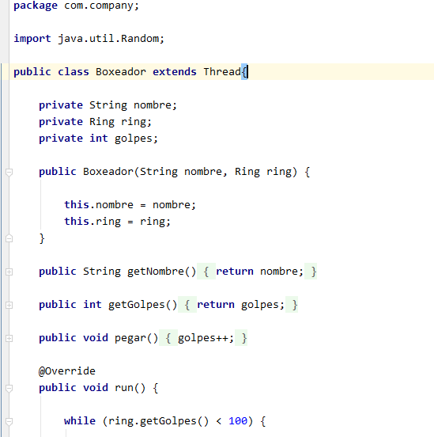
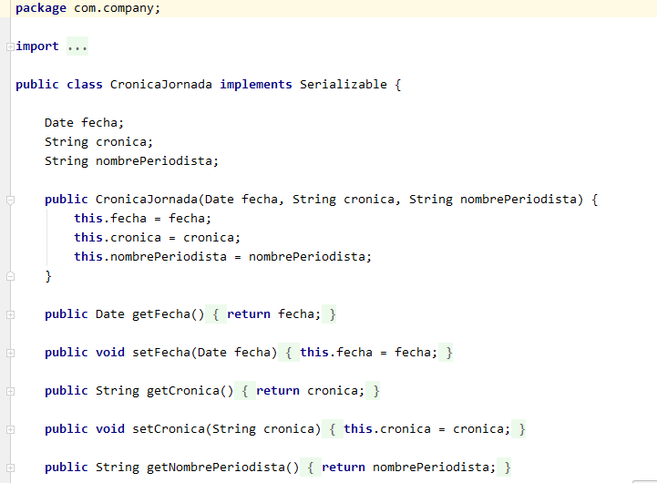

# Boxing World Series

Boxing World Series es una aplicación de consola desarrolla en lenguaje de programación Java.8 con el entorono de 
desarrollo de IntelliJ IDEA Community 19.

## Manual de usuario

El proyecto se encuentra en la carpeta testProyectoEkaitz y bastaría con ejecutar la clase Main situada en 
/src/com/company.

## Características del proyecto

La aplicación se basa en la utilización de ficheros y las correspondientes funciones realizadas sobre ellos,
creación, abrir y leer los datos para su posterior tratamiento.

Se utiliza por un lado diferentes clases de Java con sus correspondientes métodos y atributos:

Por otro lado ha sido de gran utilidad la utilización de un hilo:

Objetos serializables:

utilización de archivos Xml:

