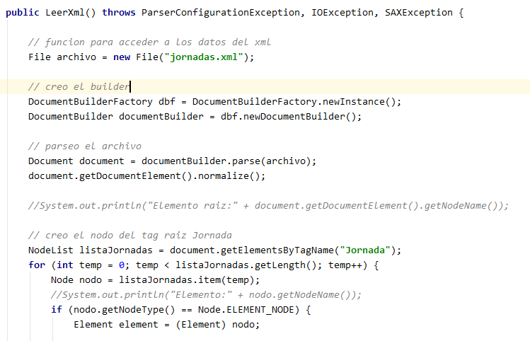
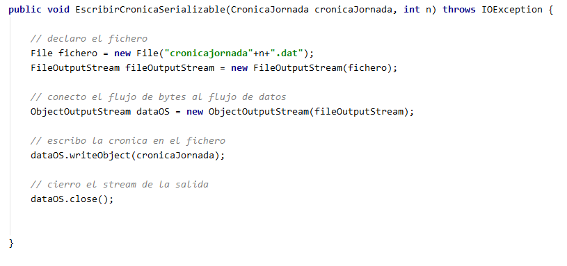

# Boxing World Series

Boxing World Series es una aplicación de consola desarrolla en lenguaje de programación Java.8 con el entorono de 
desarrollo de IntelliJ IDEA Community 19.

## Simulación

Boxing World Series simula la retransmisión en vivo mediante texto-conferencia de una final de boxeo entre Tyson y Rocky,
dos boxeadores de élite mundial, en los que el periodista/programa retransmite los tres combates de la final, realiza 
entrevistas a los medios y muestra por consola e interfaz gráfica el post-combate utilizando ficheros, para guardar 
la información y la interfaz gráfica de Javaswing. 

## Manual de usuario

El proyecto se encuentra en la carpeta testProyectoEkaitz y bastaría con ejecutar la clase Main situada en 
/src/com/company/Main.java

[Para más información ver el siguiente tutorial](https://www.youtube.com/watch?v=x43MjXGOqME&feature=youtu.be)

## Características del proyecto

La aplicación se basa en la utilización de ficheros y las correspondientes funciones realizadas sobre ellos,
creación, abrir y leer los datos para su posterior tratamiento.

Se utiliza por un lado diferentes clases de Java con sus correspondientes métodos y atributos:

Por otro lado ha sido de gran utilidad la utilización de un hilo:

Objetos serializables:

Utilización de archivos Xml:

Y trabajo con otros tipos de archivos:

